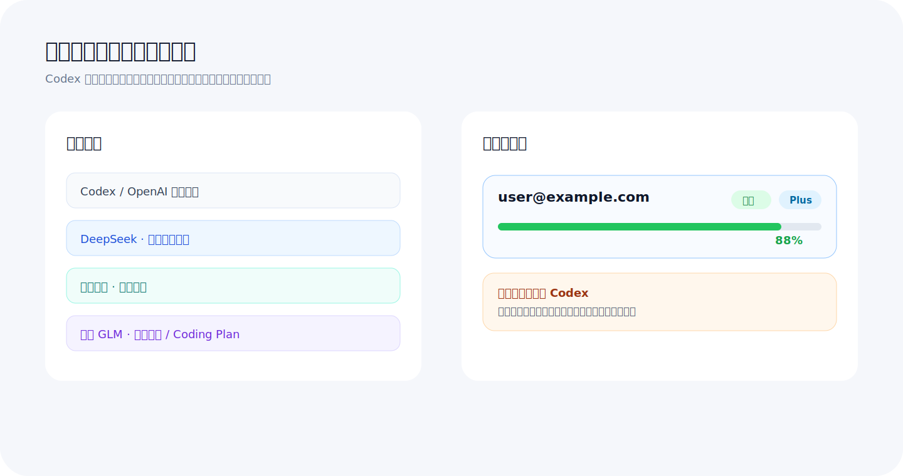

# Codex 汉化增强版｜Mac 版 Codex Desktop 简体中文语言包

Mac 版 Codex Desktop 简体中文语言包，一键安装汉化。codex汉化增强版不替代官方 Codex，而是在 macOS 桌面端补齐中文界面、Codex 中文菜单、国产模型接入、多账号切换、跳过 Codex 官方登录、小白 AI 工具箱内嵌和自动更新能力。

如果你在搜索 Codex Mac 汉化、Codex 中文、Codex Desktop Mac 汉化、Codex 简体中文、Codex 中文语言包、Codex 国产模型接入或 DeepSeek 接入，本项目就是面向 macOS 桌面 Codex 的一站式增强方案。

## 关键词

- Codex Mac 汉化、codex汉化、Codex 中文、Codex Desktop 汉化
- Mac 版 Codex Desktop 简体中文语言包、macOS 一键安装汉化
- Codex 中文菜单、Codex 设置页中文、Codex 插件页中文
- Codex 国产模型接入、DeepSeek、阿里千问、智谱 GLM
- Codex 跳过官方登录、API 登录兜底、多账号切换
- 小白 AI 工具箱、Mac 插件商店、Mac 自动热更新

## 主要能力

### Codex 简体中文语言包

- 一键安装 Codex 汉化能力，覆盖桌面 Codex 常用菜单、设置页、插件页和错误提示。
- 将第三方模型接入、更新状态、服务日志等配置项统一成中文表达。
- 面向普通用户弱化英文技术词，让报错和操作路径更容易理解。

### Mac 专用安装与热更新

- 提供 macOS PKG 安装包，面向 Apple Silicon Mac 使用。
- Mac 端使用独立 Release 通道，和 Windows 发布包分开维护，互不影响。
- 自动更新只识别 macOS 预编译资产，不会误下载 Windows 安装器或 Windows 热更新包。
- 正式发布资产是预编译产物，用户机器不需要 Node、Go、NSIS 等构建环境。

### 多 Codex 账号切换

- 在小白 AI 工具箱中提供“多账号切换”页面。
- 支持查看多个 Codex 原生账号、套餐类型、5 小时额度和周额度。
- 支持切换账号后自动重启桌面 Codex，让桌面端使用目标账号。
- 账号数据保存在桌面 Codex 专用目录，原则上不改 VS Code 的全局配置。

### 国产模型便捷接入

- 支持 DeepSeek、deepseek-v4-pro、阿里千问、智谱 GLM 等国产模型入口。
- 支持自动拉取服务商可用模型列表，用户优先下拉选择，不需要手动记模型名。
- 支持模型接入凭据可用性测试、错误原因中文解释和常见解决方式提示。
- 支持 Codex 原生模型、国产模型和 GPT 5.5 类模型之间快速切换。
- 支持跳过 Codex 官方登录，直接配置国产模型并开始使用。

### 小白 AI 工具箱内嵌

- Mac 增强包内置小白 AI 工具箱 Mac 安装资产。
- 插件商店可识别本机工具箱安装状态，并提供打开、安装或修复入口。
- 本地 HTTP API 使用协议和能力握手，避免工具箱版本不匹配时误调用能力。

### 新手自动化引导

- 检测到部署服务器、域名解析、备案、模型开户充值等上下文时，显示轻量引导卡片。
- 可调起小白 AI 工具箱，进入对应页面继续处理。
- 可结合 AiOpenTool 问答站标签推荐已有答案，减少重复问答。
- 引导卡片尽量保持小而弱，不遮挡模型正常回答。

## 适合谁

- 使用 macOS 桌面 Codex，需要 Codex 汉化、Codex 中文菜单或 Codex 简体中文语言包的用户。
- 想在 Codex 中方便使用 DeepSeek、千问、智谱等国产模型的用户。
- 有多个 Codex 账号，需要查看额度并快速切换的用户。
- 不熟悉服务器、域名、备案、模型接入凭据申请流程的新手用户。
- 希望 Mac 和 Windows 更新通道分开、只接收 macOS 发布包的用户。

## 发布包说明

GitHub Release 中面向 Mac 用户的是预编译正式发布资产，包含 macOS PKG 安装包、校验信息、版本元数据和自动更新使用的预编译热更新资产。用户不需要下载源码，也不需要在本机编译。

Mac 手动安装请优先下载 Release 中的 macOS PKG 安装包。自动更新通道使用预编译热更新资产，普通用户不需要手动下载热更新包。

## 安全边界

- 不代替用户付款、实名、提交备案或执行不可逆云资源操作。
- 模型接入凭据和账号相关数据应本地加密保存。
- 桌面 Codex 与 VS Code Codex 插件应保持配置隔离，避免互相影响登录态和沙盒设置。
- Mac 发布通道只消费 macOS 资产；Windows 发布通道继续保持独立。

## 维护方

维护方：AiOpenTool  
站点：https://aiopentool.com/
