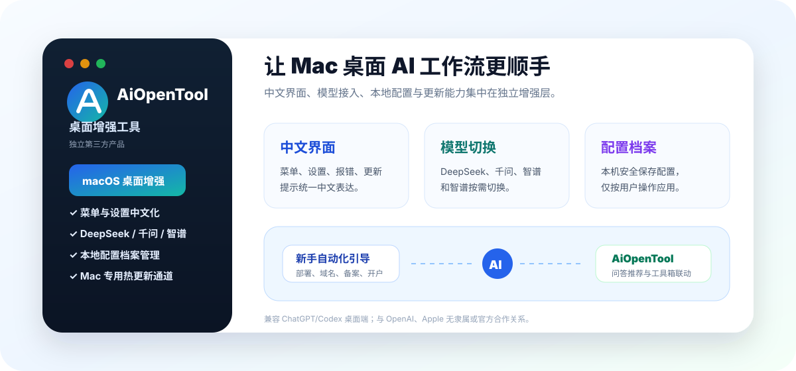
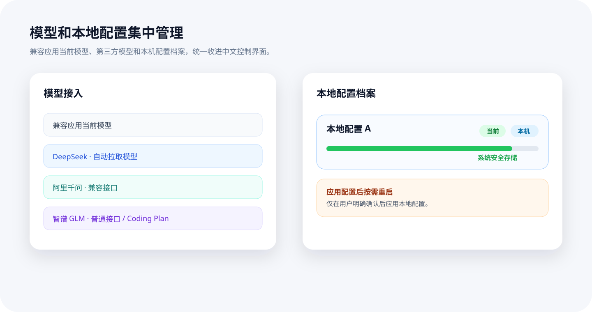

# AiOpenTool 桌面增强工具｜macOS

由 AiOpenTool 维护的独立第三方 macOS 桌面增强工具，提供中文界面、插件、第三方模型接入、本地配置档案和自动更新能力。ChatGPT/Codex 仅用于说明兼容对象，不属于本产品名称。

> **独立第三方声明：**本项目与 OpenAI、Apple 无隶属、授权、背书或官方合作关系。本项目不包含或重新分发 `ChatGPT.app`、`Codex.app` 或 OpenAI Codex CLI；用户需自行从官方渠道取得原版应用。

Mac PKG 不要求 Developer ID Installer 签名或 Apple 公证，正式发布资产会在版本元数据中明确标记为未签名、未公证。安装程序仅在用户本机复制并修改用户自行取得的兼容桌面应用，再使用当前用户钥匙串中的 AiOpenTool 本地签名证书重新签名增强副本。该副本不是 Apple 公证对象，也不是 OpenAI 发布或签署的官方应用；删除增强副本或从官方渠道重新安装原版应用，可恢复未增强的使用状态。首次打开未签名安装包时，macOS 可能要求用户在“系统设置 → 隐私与安全性”中手动允许。

## 使用文档

安装、芯片类型选择、增强功能配置和常见问题，请查看：[AiOpenTool 桌面增强工具使用文档](https://pluscodex888.github.io/codexplus-usage-docs/)。

## Windows 版

使用 Windows 的用户请前往：[AiOpenTool 桌面增强工具 Windows 版](https://github.com/pluscodex888/codex-plusplus-release)。

Mac 与 Windows 使用独立发布仓库，请根据当前系统下载对应版本，避免混用安装包。

## 当前正式版：v2.7.6

- [Apple Silicon（arm64）PKG 安装包](https://github.com/pluscodex888/codex-plusplus-release-mac/releases/download/v2.7.6/codex-plusplus-macos-arm64-slim-v2.7.6.pkg)
- [Intel（x86_64）PKG 安装包](https://github.com/pluscodex888/codex-plusplus-release-mac/releases/download/v2.7.6/codex-plusplus-macos-x64-slim-v2.7.6.pkg)
- [v2.7.6 正式 Release（全部资产与校验文件）](https://github.com/pluscodex888/codex-plusplus-release-mac/releases/tag/v2.7.6)

请根据 Mac 芯片架构选择对应安装包；每个资产的 `*.sha256` 与 `*.json` 校验/元数据文件均在 Release 中提供。

## 产品定位

- 主品牌：AiOpenTool 桌面增强工具
- 产品类型：独立第三方桌面增强工具
- 兼容说明：适用于用户自行从官方渠道取得的兼容桌面应用
- 维护方：AiOpenTool

## 主要能力

### 兼容桌面端简体中文语言包

- 为兼容桌面应用安装简体中文能力，覆盖常用菜单、设置页、插件页和错误提示。
- 将第三方模型接入、更新状态、服务日志等配置项统一成中文表达。
- 面向普通用户弱化英文技术词，让报错和操作路径更容易理解。

### Mac 专用安装与热更新

- v2.7.6 正式版已提供 Apple Silicon（arm64）与 Intel（x86_64）两套 macOS PKG 安装包。
- 公开正式渠道只提供不内置官方应用的 slim 增强包。
- Mac 端使用独立 Release 通道，和 Windows 发布包分开维护，互不影响。
- 自动更新只识别 macOS 预编译资产，不会误下载 Windows 安装器或 Windows 热更新包。
- 正式发布资产是预编译产物，用户机器不需要 Node、Go、NSIS 等构建环境。

### 本地配置档案管理

- 仅在用户明确操作后保存或应用本机配置档案。
- 配置档案使用 macOS 钥匙串或系统安全存储保护，不在公开页面展示账号、凭据或额度信息。
- 应用配置后可按需重新启动兼容桌面应用，使本地设置完整生效。
- 数据保存在兼容桌面应用的专用目录，原则上不改 VS Code 的全局配置。

### 国产模型便捷接入

- 支持 DeepSeek、deepseek-v4-pro、阿里千问、智谱 GLM 等国产模型入口。
- 支持自动拉取服务商可用模型列表，用户优先下拉选择，不需要手动记模型名。
- 支持模型接入凭据可用性测试、错误原因中文解释和常见解决方式提示。
- 支持在兼容应用当前模型与用户自行配置的第三方模型服务之间切换。
- 第三方模型使用用户自行取得的服务地址与凭据，不代表或绕过任何官方账号授权。

### 新手自动化引导

- 检测到部署服务器、域名解析、备案、模型开户充值等上下文时，显示轻量引导卡片。
- 可结合 AiOpenTool 问答站标签推荐已有答案，减少重复问答。
- 引导卡片尽量保持小而弱，不遮挡模型正常回答。

## 适合谁

- 使用 macOS 桌面 Codex，需要 Codex 汉化、Codex 中文菜单或 Codex 简体中文语言包的用户。
- 想在 Codex 中方便使用 DeepSeek、千问、智谱等国产模型的用户。
- 需要在本机管理多个配置档案的用户。
- 不熟悉服务器、域名、备案、模型接入凭据申请流程的新手用户。
- 希望 Mac 和 Windows 更新通道分开、只接收 macOS 发布包的用户。

## 发布包说明

历史 GitHub Release 当前仅保留不包含官方应用的预编译 slim 自动更新资产；旧手动安装包已停止分发。用户不需要下载源码，也不需要在本机编译。

v2.7.6 已提供正式手动安装 PKG：Apple Silicon 使用 arm64，Intel Mac 使用 x86_64。用户需要先自行从官方渠道安装兼容桌面应用；公开包不会内置官方应用。自动更新资产供已安装版本的更新通道使用，普通用户不应手动下载。

## 安全边界

- 不代替用户付款、实名、提交备案或执行不可逆云资源操作。
- 模型接入凭据和账号相关数据应本地加密保存。
- 不提供、转售或绕过任何官方账号、订阅、额度或授权能力。
- 本项目不依赖 Apple 公证；未签名、未公证包可能触发 macOS Gatekeeper，用户应仅从可信来源获取包，并按系统提示手动允许。
- 桌面 Codex 与 VS Code Codex 插件应保持配置隔离，避免互相影响登录态和沙盒设置。
- Mac 发布通道只消费 macOS 资产；Windows 发布通道继续保持独立。

## 维护方

维护方：AiOpenTool
站点：https://aiopentool.com/
